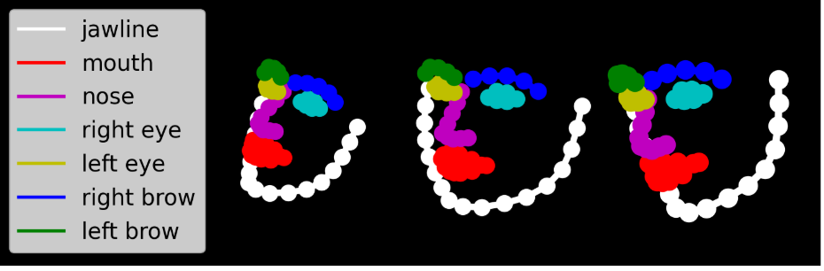

# ASDF
Autism Spectrum Disorder Face (ASDF) Dataset

Autism Spectrum Disorder Face (ASDF) dataset is a collection of children's facial landmark features extracted from videos captured for ASD screening. The dataset has 2,675,540 299-dimensional feature vectors consisting of facial landmarks, head pose, eye gaze and facial action units. Our target classification task is smile detection and the dateset is partitioned into 2,160,093 training and 515,447 testing samples.

    

We have also transformed images of facial landmarks into image segmentation masks with shapes 128x128.
Each mask contains six different labels:
0: background
1: jawline
2: eyebrows
3: nose
4: eyes
5: mouth

    
    

